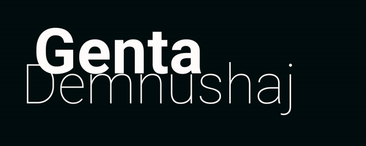

### Hi there 👋 I'm Genta!
A Graphic Designer turned Software Developer based in London, UK. 
 
### Favorite Technologies

[][javascript]
[][react]
[][redux]
[][typescript]

[javascript]: https://www.javascript.com/
[react]: https://reactjs.org/
[redux]: https://redux.js.org/
[typescript]: https://www.typescriptlang.org/
[aftereffects]: https://en.wikipedia.org/wiki/Adobe_After_Effects
[figma]: https://www.figma.com/design/
[adobeIllustrator]: https://en.wikipedia.org/wiki/Adobe_Illustrator
[adobeXD]: https://en.wikipedia.org/wiki/Adobe_XD
[photoshop]: https://en.wikipedia.org/wiki/Adobe_Photoshop
 
 

### Design Technologies

[][aftereffects]
[][figma]
[][adobeIllustrator]
[][adobeXD]
[][photoshop]

